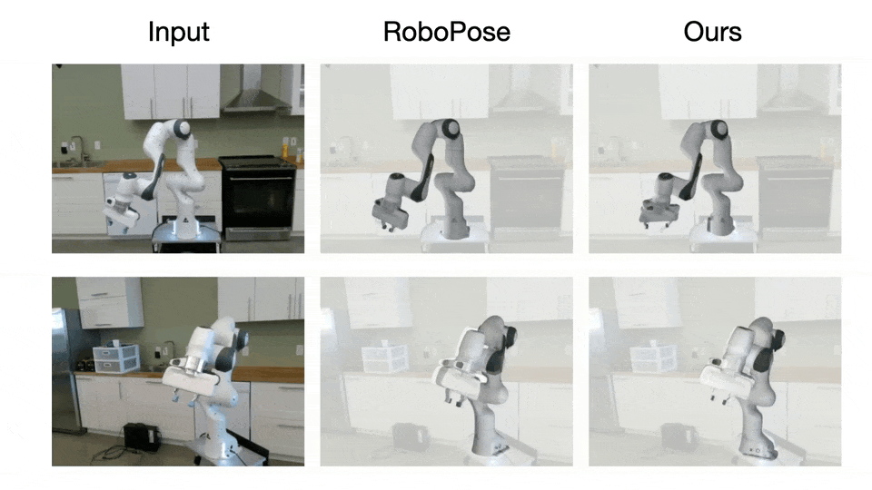

<h1 align="center"> Real-time Holistic Robot Pose Estimation with Unknown States <br> (ECCV 2024)</h1>

<div align="center">

  <a href="https://pytorch.org/get-started/locally/"></a> 
  [](https://arxiv.org/abs/2402.05655.pdf) 
  <a href="https://oliverbansk.github.io/Holistic-Robot-Pose/"></a> 
  <a href="https://www.youtube.com/watch?v=esZBchn1YX4"></a>

  [](https://paperswithcode.com/sota/robot-pose-estimation-on-dream-dataset?p=real-time-holistic-robot-pose-estimation-with)

</div>



This is the official PyTorch implementation of the paper "Real-time Holistic Robot Pose Estimation with Unknown States". It provides an efficient framework for <b>real-time</b> robot pose estimation from RGB images <b>without</b> requiring known robot states.

## Installation
This project's dependencies include python 3.9, pytorch 1.13, pytorch3d 0.7.4 and CUDA 11.7.
The code is developed and tested on Ubuntu 20.04.

```bash
    pip install torch==1.13.1+cu117 torchvision==0.14.1+cu117
    pip install -r requirements.txt
    conda install pytorch3d=0.7.4 # from https://anaconda.org/pytorch3d/pytorch3d/files
```

## Data and Model Preparation

In our work, we use the following data and pretrained model:
* The [DREAM datasets](https://drive.google.com/drive/folders/1uNK2n9wU4tRE07sM_r640wDhwmOwuxx6) consisting of both real and synthetic subsets, placed under `${ROOT}/data/dream/$`.
* The [URDF](https://drive.google.com/drive/folders/17KNhy28pypheYfDCxgOjJf4IyUnOI3gW?) (Unified Robotics Description Format) of robot Panda, Kuka and Baxter, placed under `${ROOT}/data/deps/$`.
* The [pretrained HRnet backbone](https://drive.google.com/file/d/1eqIftq1T_oIGhmCfkVYSM245Wj5xZaUo/view?) for pose estimation, placed under `${ROOT}/models/$`.
* The openly available [foreground segmentation model](https://drive.google.com/drive/folders/1PpXe3p5dJt9EOM-fwvJ9TNStTWTQFDNK?) of 4 real datasets of Panda from [CtRNet](https://github.com/ucsdarclab/CtRNet-robot-pose-estimation), placed under `${ROOT}/models/panda_segmentation/$`.

You can download the data and models through provided links. 
When finished, the directory tree should look like this. 
```
${ROOT}
|-- data
    |-- dream
    |   |-- real
    |   |   |-- panda-3cam_azure  
    |   |   |-- panda-3cam_kinect360
    |   |   |-- panda-3cam_realsense
    |   |   |-- panda-orb
    |   |-- synthetic
    |   |   |-- baxter_synth_test_dr
    |   |   |-- baxter_synth_train_dr
    |   |   |-- kuka_synth_test_dr
    |   |   |-- kuka_synth_test_photo
    |   |   |-- kuka_synth_train_dr
    |   |   |-- panda_synth_test_dr
    |   |   |-- panda_synth_test_photo
    |   |   |-- panda_synth_train_dr
    |-- deps
    |   |-- baxter-description
    |   |-- kuka-description
    |   |-- panda-description
|-- models
    |-- panda_segmentation
    |   |-- azure.pth
    |   |-- kinect.pth
    |   |-- orb.pth
    |   |-- realsense.pth
    |-- hrnet_w32-36af842e_roc.pth
```

## Train
We train our final model in a multi-stage fashion. All model is trained using a single NVIDIA V100 with 32GB GPU. Distributed training is also supported.

We use config files in `configs/` to specify the training process. We recommend filling in the `exp_name` field in the config files with a unique name, as the checkpoints and event logs produced during training will be saved under `experiments/{exp_name}`. The correspondent config file will be automatically copied into this directory.

### Synthetic Datasets

Firstly, pretrain the depthnet (root depth estimator) for 100 epochs for each robot arm:
```bash
python scripts/train.py --config configs/panda/depthnet.yaml
python scripts/train.py --config configs/kuka/depthnet.yaml
python scripts/train.py --config configs/baxter/depthnet.yaml
```

With depthnet pretrained, we can train the full network for 100 epochs:
```bash
python scripts/train.py --config configs/panda/full.yaml
python scripts/train.py --config configs/kuka/full.yaml
python scripts/train.py --config configs/baxter/full.yaml
```
To save your time when reproducing results of our paper, we provide readily-pretrained [depthnet model weights](https://drive.google.com/drive/folders/1rWC2bbA3U0IiZ7oDoKIVsWK_m4JkVarA?) for full network training. To use them, you can modify the `configs/{robot}/full.yaml` file by filling in the `pretrained_rootnet` field with the path of the downloaded `.pk` file. 

### Real Datasets of Panda

We employ self-supervised training for the 4 real datasets of Panda.

Firstly, train the model on synthetic dataset using `configs/panda/self_supervised/synth.yaml` for 100 epochs. Be sure to fill in the `pretrained_rootnet` field with the path of the pretrained Panda depthnet weight in advance.

```bash
python scripts/train.py --config configs/panda/self_supervised/synth.yaml
```
The training process above saves checkpoints for 4 real datasets for further self-supervised training (e.g. `experiments/{exp_name}/ckpt/curr_best_auc(add)_azure_model.pk`). 

When finished training on synthetic data, modify the `configs/panda/self_supervised/{real_dataset}.yaml` file by filling in the `pretrained_weight_on_synth` field with the path of the correspondent checkpoint. Then start self-supervised training with:

```bash
python scripts/train.py --config configs/panda/self_supervised/azure.yaml
python scripts/train.py --config configs/panda/self_supervised/kinect.yaml
python scripts/train.py --config configs/panda/self_supervised/realsense.yaml
python scripts/train.py --config configs/panda/self_supervised/orb.yaml
```

## Test
To evaluate models, simply run:
```bash
python scripts/test.py --exp_path {path of the experiment folder} --dataset {dataset name}
# e.g. python scripts/test.py -e experiments/panda_full --dataset panda_synth_test_dr
```
Note that each model is presented in a folder containing ckpt/, log/ and config.yaml. After running test script, result/ will be generated inside the folder.

## Model Zoo
You can download our final models from [Google Drive](https://drive.google.com/drive/folders/10Gz0NP39YyuvAlrhTa-XssWTDlyh9v80?usp=sharing) and evaluate them yourself.  


## Citation
If you use our code or models in your research, please cite with:
```bibtex
@inproceedings{holisticrobotpose,
  author={Ban, Shikun and Fan, Juling and Ma, Xiaoxuan and Zhu, Wentao and Qiao, Yu and Wang, Yizhou},
  title={Real-time Holistic Robot Pose Estimation with Unknown States},
  booktitle = {European Conference on Computer Vision (ECCV)},
  year = {2024}
}
```

## Acknowledgment
This repo is built on the excellent work [RoboPose](https://github.com/ylabbe/robopose) and [CtRNet](https://github.com/ucsdarclab/CtRNet-robot-pose-estimation). Thank the authors for releasing their codes.
